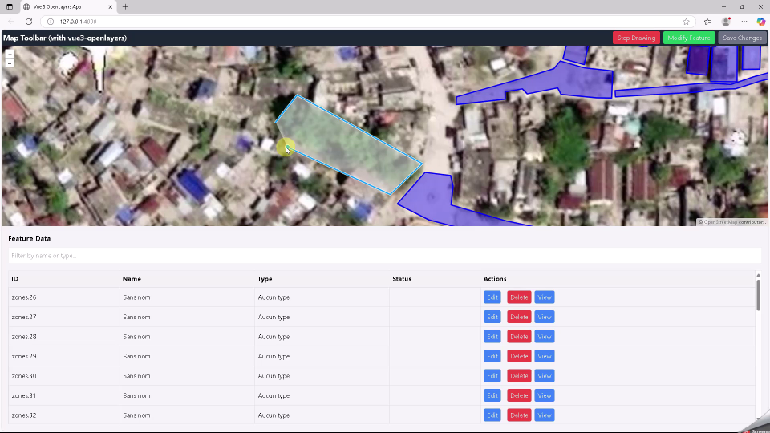
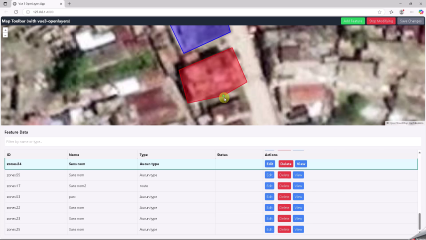

# OpenLayers + Vue 3 WFS Layer Editor

This project demonstrates how to integrate [OpenLayers](https://openlayers.org/) with [Vue 3](https://vuejs.org/) to enable editing of a WFS (Web Feature Service) layer. It provides a basic application where users can view, add, modify, and delete features from a remote WFS-T service.

## Features

- Integration of OpenLayers in a Vue 3 component.
- Loading vector features from a WFS endpoint.
- Editing geometries (draw, modify, delete).
- Transactional WFS (WFS-T) support: send updates to a GeoServer (or compatible WFS-T service).
- Styled vector layers.
- Minimal UI for interaction.

## Technologies

- [Vue 3 + Vite](https://vitejs.dev/)
- [OpenLayers](https://openlayers.org/)
- [GeoServer](https://geoserver.org/)

## Installation

```bash
git clone https://github.com/voirinprof/gis_vue3_openlayers.git
cd gis_vue3_openlayers
npm install
npm run dev
```

## Usage

1. Make sure you have access to a running WFS-T service (e.g., GeoServer) with a layer configured for editing.
2. Update the WFS service URL and feature type in `.env`:

```js
VITE_WFS_URL=http://localhost/geoserver/geoimage/wfs
VITE_WFS_FEATURE_TYPE=geoimage:zones
VITE_WMS_URL=http://localhost/geoserver/geoimage/wms
VITE_WMS_LAYERS=geoimage:haiti
VITE_MAP_CENTER_LAT=18.188
VITE_MAP_CENTER_LNG=-73.753
VITE_DEFAULT_ZOOM=18
```

3. Start the application:

```bash
npm run dev
```

4. Use the map UI to:

   * Draw new features.
   * Select and modify existing ones.
   * Delete features.

Changes are sent via WFS-T (Insert, Update, Delete) to the WFS backend.

## Project Structure

```bash
├── src/
│   ├── router/
│   │   └── index.js  # navigation rules
│   ├── stores/
│   │   └── zones.js  # store for the WFS-T
│   ├── views/
│   │   └── HomeView.vue  # Main View
│   ├── components/
│   │   ├── Map.vue         # Map component
│   │   ├── DataTable.vue   # Table component
│   │   └── Toolbar.vue     # Toolbar component
│   ├── App.vue             # Root Vue component
│   └── main.js             # Application entry point
├── public/
├── index.html
├── .env  # config
└── vite.config.js
```

## Security

This demo does not include authentication. In a production environment, use appropriate authentication and authorization mechanisms.

### Screenshots





---

### Links

* [vue3-openlayers Examples](https://vue3openlayers.netlify.app/get-started.html)
* [GeoServer WFS-T Guide](https://docs.geoserver.org/stable/en/user/services/wfs/transactions.html)